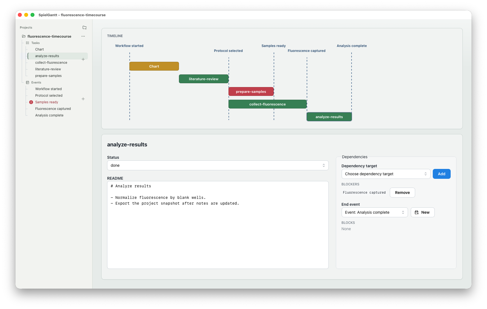

# SpielGantt

SpielGantt is a local-first desktop Gantt tool for scientific workflows. It
keeps the durable project state in ordinary folders and JSON metadata, so a
workflow remains readable, scriptable, and useful even without the GUI.

SpielGantt is built as a Tauri desktop app with a Rust CLI/core and a
React/Mantine frontend. The CLI and GUI operate on the same package format.



## What It Does

- Tracks scientific workflow tasks as ordinary folders.
- Stores SpielGantt-owned metadata under hidden `.spielgantt/` directories.
- Leaves notes, data, scripts, notebooks, and other user files alone.
- Models dependencies between tasks and timeline events.
- Provides a desktop GUI for browsing projects, editing task metadata, and
  viewing event-based timelines.
- Provides a CLI for validation, automation, repair, export, and package
  mutations.

## Example Project

The repository includes a sample workflow at
`examples/fluorescence-timecourse`. It models a small experiment with protocol
selection, sample preparation, fluorescence capture, analysis, and charting.

Validate the example:

```sh
cargo run --manifest-path src-tauri/Cargo.toml -- validate examples/fluorescence-timecourse
```

Inspect the example workflow as JSON:

```sh
cd examples/fluorescence-timecourse
cargo run --manifest-path ../../src-tauri/Cargo.toml -- task workflow --json
```

In the GUI, choose `Open Existing Project...` and select
`examples/fluorescence-timecourse`. The sidebar shows task buckets and project
events; the main timeline uses those events as milestones.

## Project Format

A SpielGantt project is any folder containing `.spielgantt/project.json`.
Tasks are ordinary child folders containing `.spielgantt/task.json`.

```text
fluorescence-timecourse/
  .spielgantt/
    project.json
  collect-fluorescence/
    .spielgantt/
      task.json
    data/
      raw-observations.csv
    README.md
  analyze-results/
    .spielgantt/
      task.json
    README.md
```

Files outside `.spielgantt/` are user files. SpielGantt may create task
folders and README files for convenience, but it does not treat user content as
application-owned data.

## Install

### macOS DMG Installer

1. Open this repository's [GitHub Releases](../../releases) page.
1. Download `SpielGantt_*.dmg` from the latest release.
1. Open the disk image.
1. Drag `SpielGantt.app` to the `Applications` shortcut.
1. Launch `SpielGantt.app` from Finder, Spotlight, or Launchpad.

The app is not yet signed or notarized with an Apple Developer ID. On first
launch, macOS may require approving it in System Settings.

The packaged CLI is inside the app bundle:

```sh
/Applications/SpielGantt.app/Contents/MacOS/spielgantt --help
```

### CLI From Source

Install the development CLI on your shell path:

```sh
cargo install --path src-tauri --bin spielgantt
```

Then run:

```sh
spielgantt --help
spielgantt validate /path/to/project
```

## Build From Source

### Prerequisites

- Node.js and npm
- Rust and Cargo
- Platform dependencies required by
  [Tauri v2](https://v2.tauri.app/start/prerequisites/)

### macOS

macOS is the currently verified desktop package target.

```sh
npm install
npm run release:build
```

The generated installer and app bundle are:

```text
src-tauri/target/release/bundle/dmg/SpielGantt_*.dmg
src-tauri/target/release/bundle/macos/SpielGantt.app
```

### Windows

Windows packaging is not yet release-verified for this project. To compile
locally after installing the Tauri Windows prerequisites:

```sh
npm install
npm run build
cargo test --manifest-path src-tauri/Cargo.toml
npm run tauri -- build
```

Build and bundle outputs are written under:

```text
src-tauri/target/release/bundle
```

Before a Windows release, this project still needs a verified installer target
such as NSIS or MSI and smoke tests against Windows file-opening behavior.

### Linux

Linux packaging is not yet release-verified for this project. To compile
locally after installing the Tauri Linux prerequisites for your distribution:

```sh
npm install
npm run build
cargo test --manifest-path src-tauri/Cargo.toml
npm run tauri -- build
```

Build and bundle outputs are written under:

```text
src-tauri/target/release/bundle
```

Before a Linux release, this project still needs a verified target such as
AppImage, deb, or rpm and smoke tests against Linux file-opening behavior.

## Development

Install dependencies:

```sh
npm install
```

Run the main checks:

```sh
npm run test:frontend
npm run test:release
npm run test:architecture
cargo test --manifest-path src-tauri/Cargo.toml
```

Run the frontend dev server:

```sh
npm run dev
```

Build frontend assets:

```sh
npm run build
```

Build and verify the macOS release candidate:

```sh
npm run release:build
```

## Release Status

- macOS DMG installers are the only production GUI package currently verified.
- For releases, tagged pushes matching `v*` build `SpielGantt.app`, package it
  as `SpielGantt_*.dmg`, upload it as a workflow artifact, and attach it to the
  GitHub release.
- The release workflow uses GitHub's built-in `GITHUB_TOKEN`; repository
  workflow permissions must allow `contents: write`.
- Windows and Linux can be compiled from source, but their distributable
  package targets are not yet release-verified.

## License

SpielGantt uses a split license. Files under `src-tauri/`, including the Rust
backend, CLI, package-domain library, Tauri command adapters, build
configuration, and Rust tests, are licensed under the BSD 3-Clause License.
The frontend user interface, visual design, examples, documentation, and all
other repository contents outside `src-tauri/` are licensed under the PolyForm
Noncommercial License 1.0.0 unless a file states otherwise.

See `LICENSE.txt` for the license map and full license references.

## More Documentation

- `docs/user-guide.md`: user workflow, project layout, GUI controls, and CLI
  examples.
- `docs/metadata/contract.md`: package metadata contract.
- `docs/agent-cli-contract.md`: CLI JSON contracts for automation agents.
- `CONTRIBUTING.md`: contributor workflow and release checks.
- `AGENTS.md`: repository instructions for coding agents.
